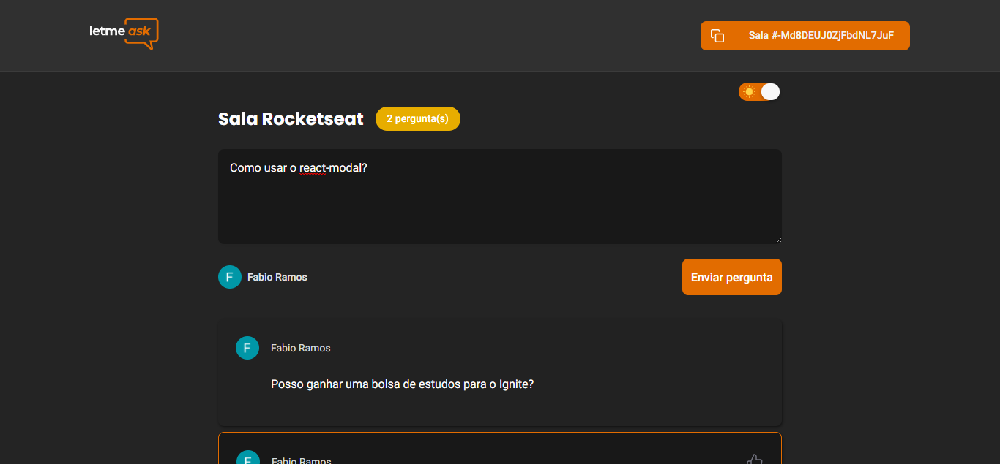

<h1 align="center">
    
</h1>

<p align="center">
    <a href="#headphones-about">About</a> •
    <a href="#computer-layout">Layout</a> •
    <a href="#rocket-getting-started">Getting Started</a> • 
    <a href="#microscope-technologies">Technologies</a> • 
    <a href="#pencil2-author">Author</a> • 
    <a href="#pencil-license">License</a>
</p>

<h1 align="center">
    
</h1>

## :headphones: About

Letmeask is perfect for content creators to be able to create Q&A rooms with their audience, in a very organized and democratic way.

If you want to checkout click [Letmeask](https://letmeask-38005.web.app/)


This is a project developed during the **[Next Level Week](https://nextlevelweek.com/)**, presented by **[@Rocketseat](https://github.com/Rocketseat)**.

---

## :computer: Layout

You can view the project layout through the links below:

- [Layout Web](https://www.figma.com/file/hFMveMlPTt0xYVcRZa4Skx/Letmeask-(Copy)?node-id=0%3A1) 

Remembering that you need to have a [Figma](http://figma.com/) account to access it.

### :globe_with_meridians: Web

<p align="center">
  

  
</p>

### :iphone: Web Mobile

<p align="center" style="display: flex; align-items: flex-start; justify-content: center;">
  

  
</p>

### :bulb: Dark Mode

<p align="center" style="display: flex; align-items: flex-start; justify-content: center;">
  
  
</p>

<p align="center" style="display: flex; align-items: flex-start; justify-content: center;">
  
  
</p>

---

## :rocket: Getting Started

### Requirements

- You need to install both [Node.js](https://nodejs.org/en/download/) and [Yarn](https://yarnpkg.com/) to run this project.

**Clone the project and access the folder**

```bash
$ git clone https://github.com/FabioRamos12/let-me-ask.git && cd let-me-ask
```

**Follow the steps below**

```bash
# Install the dependencies
$ yarn

# Run the project
$ yarn start
```

The app will be available for access on your browser at `http://localhost:3000`

Remembering that it will be necessary to create an account in [Firebase](https://firebase.google.com/) and a project to make the Realtime Database available.

Don't forget to copy and paste the Firebase configuration containing your app's keys and identifiers into the .env.local file.

```bash
#Copy and paste this code on Rules(Regras) tab
{
  "rules": {
    "rooms": {
      ".read": true,
      ".write": "auth != null",
      "$roomId": {
        ".read": true,
        ".write": "auth != null && (!data.exists() || data.child('authorId').val() == auth.id)",
        "questions": {
					".read": true	,
          ".write": "auth != null && (!data.exists() || data.parent().child('authorId').val() == auth.id)",
        	"likes": {
						".read": true,
            ".write": "auth != null && (!data.exists() || data.child('authorId').val() == auth.id)",
          }
        }
      }
		}
  }
}
```
---

## :microscope: Technologies

This project was developed using the following technologies:

- [React](https://reactjs.org)
- [Firebase](https://firebase.google.com/)
- [TypeScript](https://www.typescriptlang.org/)

---

## :pencil2: Author

 
 <span>Fabio Ramos</span>

[](https://www.linkedin.com/in/fabioalvesramos/) 
[](mailto:fabioalvesramos12@gmail.com)

---

## :pencil: License

This project is under the license [MIT](./LICENSE).

---